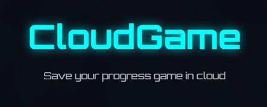
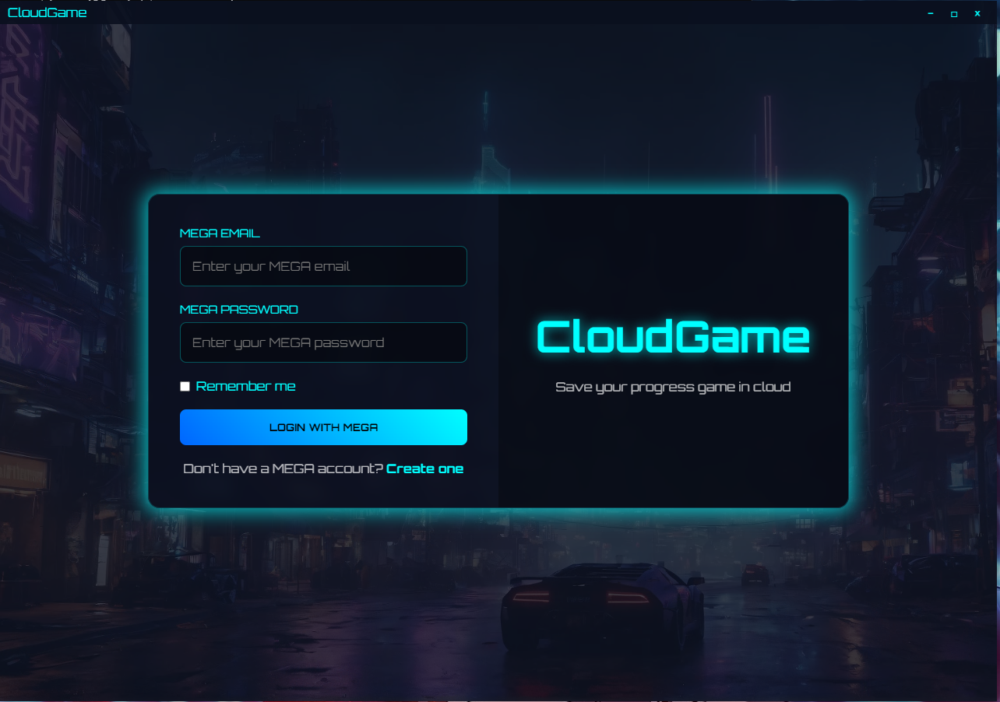
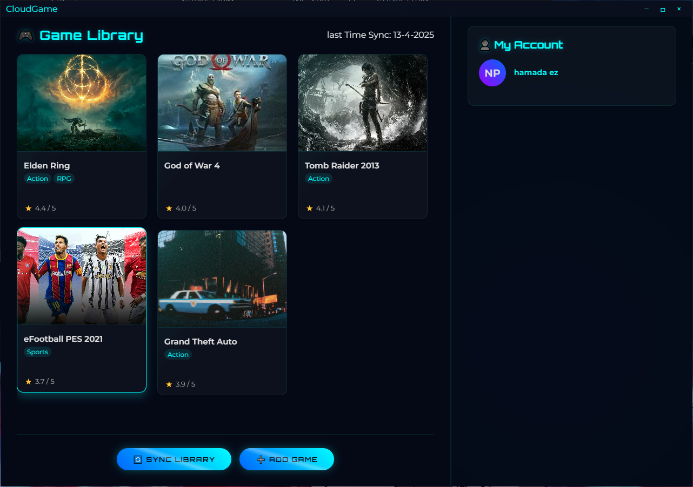
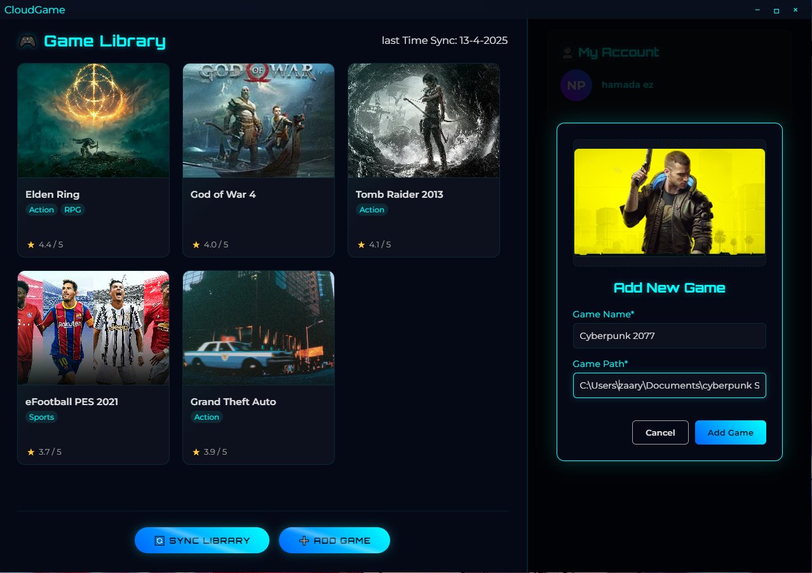
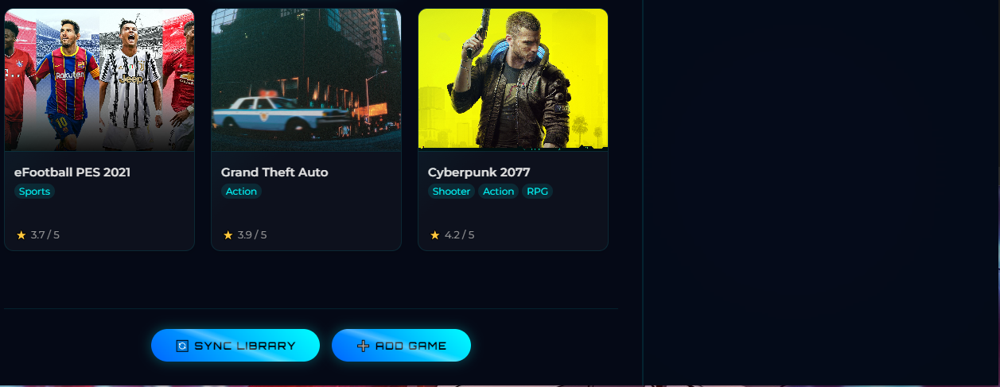

# CloudGame – Mega-Powered Game Save Sync for Windows  

 

Manuly back up and sync game saves to **Mega.nz**—perfect for non-Steam games or multi-PC setups.  

---

## 🔥 Features  
✅ **Mega Cloud Backup** – End-to-end encrypted sync to your Mega.nz account (20GB free).  
✅ **Cross-Game Support** – Works with Steam, Epic, GOG, emulators, and indie games.  
✅ **Set-and-Forget** – Runs silently in the background; no manual backups needed.  
✅ **Lightweight** – Minimal CPU/RAM usage.  

---

## 📥 Installation  
1. **Download** the latest release from [Releases](#) *(link to your releases page)*.  
2. **Run** `CloudGame_Installer.exe` (admin rights recommended).  
3. **Log in** to your Mega.nz account when prompted.  

## Login Page 

## Dashboard Page

## Add Game 

## Added Game

## The press sync library button

## ❓ FAQ  
**Q: Is my data secure?**  
A: Yes! Files are encrypted via Mega.nz’s E2EE before upload.  

**Q: Can I use Google Drive/Dropbox instead?**  
A: Currently only Mega.nz is supported (future updates may expand options).  

**Q: Does it work on Linux?**  
A: Windows-only (Wine/Proton untested).  

---

## 📜 License  
MIT License – Free to use and modify. *Not affiliated with Mega.nz.*  

---

*💻 Contribute or report issues on [GitHub](#)!*  